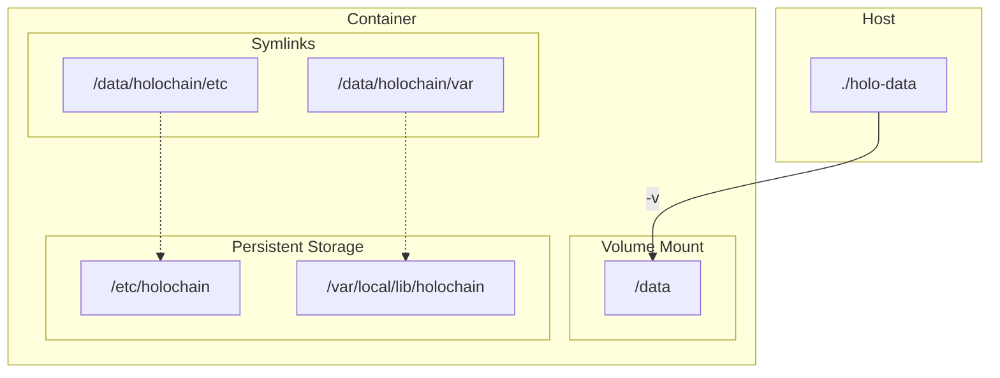

# Trailblazer

A docker container for running Holochain and installing hApps to host them as always-on-nodes.

## Table of Contents

- [Prerequisites](#prerequisites)
- [Getting Started](#getting-started)

   - [Obtaining the Image](#obtaining-the-image)
   - [Running the Container](#running-the-container)

- [Usage](#usage)

   - [Interactive Shell Access](#interactive-shell-access)
   - [Creating a Holochain Sandbox](#creating-a-holochain-sandbox)
   - [Installing a hApp in the Sandbox](#installing-a-happ-in-the-sandbox)

      - [Scripted Install](#scripted-install)
      - [Manual Install (Kando Example)](#manual-install-kando-example)

   - [Running the Sandbox in Debug Mode](#running-the-sandbox-in-debug-mode)
   - [Troubleshooting Logs](#troubleshooting-logs)

- [Production Deployment with Conductor](#production-deployment-with-conductor)
- [Process Management and Logging](#process-management-and-logging)
- [Persistent Storage](#persistent-storage)

   - [Overview](#overview)
   - [Testing Persistence](#testing-persistence)

- [Developer Instructions](#developer-instructions)

   - [Testing Holochain and hc](#testing-holochain-and-hc)

## Prerequisites

- Docker installed and running.
- A GitHub personal access token (classic) with `read:packages` access on the Trailblazer repo if you need to pull private images.

## Getting Started

### Obtaining the Image

Private images are available from [GitHub Packages](https://github.com/Holo-Host/trailblazer/pkgs/container/trailblazer).

```sh
# Log in to GitHub Container Registry
docker login ghcr.io

# Pull the latest image
docker pull ghcr.io/holo-host/trailblazer
```

### Running the Container

To run the container with persistent storage, you need to map a local directory on your host machine to the `/data` volume in the container.

1. **Create a host directory for persistence:**
2. **Run the container:**

For basic usage (interactive mode), run without `CONDUCTOR_MODE`:

```sh
docker run --name trailblazer -dit \
  -v $(pwd)/holo-data:/data \
  ghcr.io/holo-host/trailblazer
```

To auto-start the Holochain conductor with supervised process management and logging (see [Process Management and Logging](#process-management-and-logging)), set `CONDUCTOR_MODE=true`:

```sh
docker run --name trailblazer -dit \
  -e CONDUCTOR_MODE=true \
  -v $(pwd)/holo-data:/data \
  -p 4444:4444 \
  ghcr.io/holo-host/trailblazer
```

This will start the container in detached mode and name it `trailblazer`. Manual `hc run` commands are still possible inside the container but will now be supervised by tini.

## Usage

### Interactive Shell Access

To access an interactive shell in the running container:

```sh
docker exec -it trailblazer /bin/sh
```

### Creating a Holochain Sandbox

Once you have an interactive shell, you can create a Holochain sandbox.

1. **Switch to the `nonroot` user:**

```sh
su - nonroot
```

2. **Create the sandbox:**
   The `entrypoint.sh` script sets up symlinks for persistent storage, so you can use the standard paths. The following command will create a sandbox in `/home/nonroot` and configure it to use persistent storage for the conductor config and data.

```sh
hc sandbox create --root /home/nonroot/ \
  --conductor-config /etc/holochain/conductor-config.yaml \
  --data-root-path /var/local/lib/holochain
```

_Note: The `data_root_path` and `lair_root` in the generated `conductor-config.yaml` will point to `/var/local/lib/holochain`._

3. **Configure WebRTC:**
   You need to add WebRTC details to your conductor configuration file to allow for peer-to-peer communication.

```sh
vi /home/nonroot/conductor-config.yaml
```

Find the `webrtc_config` stanza and replace it with the following:

```yaml
  webrtc_config:
    iceServers:
      - urls:
          - stun:stun.cloudflare.com:3478
      - urls:
          - stun:stun.l.google.com:19302
```

4. **Run the sandbox:**

```sh
hc sandbox run 0
```

Note the `admin_port` displayed after the sandbox is run. You will need it to install hApps.

### Installing a hApp in the Sandbox

#### Scripted Install

You can use the `install_happ` script to install a hApp from a JSON configuration file.

1. **Get another interactive shell to the container.**
2. **Run the script:**

```sh
su - nonroot
export ADMIN_PORT=<admin_port>
install_happ <config.json> $ADMIN_PORT
```

#### Listing Installed hApps

To list installed hApps, use the `list_happs` script.

1. **Get another interactive shell to the container.**
2. **Run the script:**

```sh
su - nonroot
export ADMIN_PORT=<admin_port>
list_happs $ADMIN_PORT
```

Or with default port:

```sh
list_happs
```

#### Manual Install (Kando Example)

1. **Get another interactive shell to the container.**
2. **Switch to the `nonroot` user and set the admin port:**

```sh
su - nonroot
export ADMIN_PORT=<admin_port>
```

3. **Install the hApp:**

```sh
export AGENT_KEY=$(hc s -f $ADMIN_PORT call new-agent | awk '{print $NF}')
export APP_ID="kando::v0.13.0::$AGENT_KEY"
wget https://github.com/holochain-apps/kando/releases/download/v0.13.0/kando.happ
export NETWORK_SEED="<network_seed>"
hc s -f $ADMIN_PORT call install-app ./kando.happ $NETWORK_SEED --agent-key "$AGENT_KEY" --app-id "$APP_ID"
```

4. **Verify the installation:**

```sh
hc s -f $ADMIN_PORT call list-apps
hc s -f $ADMIN_PORT call dump-network-stats
```

### Running the Sandbox in Debug Mode

To get more verbose output from your sandbox, you can run it with the `RUST_LOG` environment variable set to `debug`.

```sh
RUST_LOG=debug hc sandbox run 0
```

### Troubleshooting Logs

Holochain logs are redirected to `/data/logs/holochain.log` inside the container for persistence.

- If using a volume mount (e.g., `-v $(pwd)/holo-data:/data`), access logs directly from the host at `./holo-data/logs/holochain.log`.
- To copy logs from a running container: `docker cp trailblazer:/data/logs/holochain.log .`
- View live logs: `docker exec -it trailblazer tail -f /data/logs/holochain.log`

Logs are rotated daily (see [Process Management and Logging](#process-management-and-logging)) with 7 days retention.

## Production Deployment with Conductor

To deploy in production using the Holochain conductor:

0. Remove any prior containers if you need to: `docker stop trailblazer && docker rm trailblazer`
1. __Run the Container__
The Holochain conductor will start up automatically with the container:

```sh
docker run --name trailblazer -dit \
  -v $(pwd)/holo-data:/data \
  -p 4444:4444 \
  ghcr.io/holo-host/trailblazer
```

2. **Conductor Configuration**

   The Conductor configuration in this container operates on certain conventions:

   - Admin port must be `4444`
   - `lair_root` must be empty
   - Configuration must use LSB-compliant paths

3. **Persistent Configuration**
   The conductor configuration is persisted through the same volume mount structure as sandbox mode:

   - `/etc/holochain` → `/data/holochain/etc`
   - `/var/local/lib/holochain` → `/data/holochain/var`

### Process Management and Logging

The container uses advanced process management and logging for reliability in production.

#### Process Management

- **tini as PID 1**: The init system `tini` is used as the container's PID 1. It handles process supervision, reaps zombie processes, and can restart the Holochain conductor if it crashes (configured via entrypoint.sh).
- **Non-root User**: All processes run as user ID 65532 (nonroot) for security.
- __Supervisor Behavior__: When `CONDUCTOR_MODE=true`, entrypoint.sh execs `tini -- holochain run ...`, ensuring proper signal handling and restarts. Manual `hc run` commands inside the container are also supervised.

#### Logging

- **Redirection**: Holochain output is redirected to `/data/logs/holochain.log` using `> /data/logs/holochain.log 2>&1` in entrypoint.sh. This captures stdout/stderr for persistence.
- **Persistence**: Logs are stored in the `/data` volume, ensuring they survive container restarts.
- **Directory Setup**: entrypoint.sh creates `/data/logs` if it doesn't exist.

#### Log Rotation

- **Configuration**: Defined in `/etc/logrotate.d/holochain.conf` for daily rotation, keeping 7 days of logs, with compression (gzip).
- **Background Loop**: entrypoint.sh starts a background loop (`while true; do logrotate /etc/logrotate.d/holochain.conf; sleep 86400; done`) to run rotation daily.

This setup ensures robust logging and process reliability without manual intervention.

## Persistent Storage

### Overview

The container is configured to store all persistent data in the `/data` directory. This directory is then symlinked to the appropriate locations for Holochain to use.

The following diagram illustrates the volume mapping and symlinks:



- The `holo-data` directory on the host is mounted to `/data` in the container.
- `/data/holochain/etc` is symlinked to `/etc/holochain`.
- `/data/holochain/var` is symlinked to `/var/local/lib/holochain`.

This means that any data written to `/etc/holochain` or `/var/local/lib/holochain` inside the container will be persisted in the `holo-data` directory on your host machine.

### Testing Persistence

A test harness script is provided to verify that persistence is working correctly.

To run the test:

```sh
docker/test_persistence.sh
```

The script will:

1. Create a temporary directory for test data.
2. Start a container and create a test file in a persistent location.
3. Stop and remove the container.
4. Start a new container using the same data directory.
5. Verify that the test file still exists.
6. Clean up all test resources.

## Developer Instructions

### Testing Holochain and hc

To quickly test that the `holochain` and `hc` binaries are functional:

```sh
docker run --name trailblazer -dit ghcr.io/holo-host/trailblazer
docker exec -it trailblazer /bin/sh
which holochain
which hc
holochain --version
 hc --version
lair-keystore --version
```