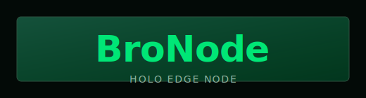

# BroNode (desktop GUI)



Cross-platform desktop dashboard for operating a Holo **Edge Node** container locally under the **BroNode** name (Windows, macOS, Linux).

**Downloads (pre-built):** [github.com/ta10101/BroNode/releases](https://github.com/ta10101/BroNode/releases) → open **BroNode GUI `bronode/v…`** for `.exe`, Linux `.tar.gz`, and macOS `.zip` (same layout when published from [Holo-Host/edgenode](https://github.com/Holo-Host/edgenode) after merge).

**Publishing:** push tag `bronode/v*` (see [RELEASING.md](RELEASING.md)); CI builds and attaches assets to that GitHub Release.

Release roadmap (**steps 1–4**): see [PACKAGING.md](PACKAGING.md).  
**Install, uninstall, Docker vs GUI:** [docs/INSTALL_AND_UNINSTALL.md](docs/INSTALL_AND_UNINSTALL.md).

## Friendlier install (not a developer)

- **Windows:** run **`BroNodeSetup.msi`**. You get a normal installer with **screens that explain each step**, a **folder you can change** (the default is fine), and a **progress bar** while files copy. After install, open BroNode from the Start menu — a **short welcome window** appears once and tells you that **Docker** is required and what **Start Here** does.
- **macOS:** copy **`BroNode.app`** to **Applications** and open it — the same **one-time welcome** appears. You may need to allow the app in **Privacy & Security** the first time (unsigned builds). For downloads outside the App Store, Apple prefers **signed / notarized** apps (see [PACKAGING.md](PACKAGING.md)).
- **Linux:** extract the **`.tar.gz`**, open a terminal **in that folder**, run **`./install.sh`**. The script **prints each step** (copy files, menu shortcut, etc.). Docker is still something you install separately from your distro.

To **see the welcome again** (e.g. after showing someone else), delete the file **`welcome_ok_v1`** inside the app data folder (`%LOCALAPPDATA%\BroNode` on Windows, `~/Library/Application Support/BroNode` on macOS, `~/.config/bronode` on Linux). To **skip** the welcome (automation), set environment variable **`BRONODE_SKIP_WELCOME=1`** before starting BroNode.

## What it includes

- Container health overview (`running`, status, image, started time)
- Quick Docker stats (`CPU`, memory, network I/O, block I/O, PIDs)
- Tool actions:
  - Pull image
  - Run container
  - Start/Stop/Restart
  - Open shell inside container
  - Follow logs in new terminal window
- Embedded logs view (last 200 lines)
- CPU and memory history chart (rolling samples)
- hApp config tool integration (`create` and `validate` via `happ_config_file`)
- hApp operations tab for container commands:
  - `install_happ`
  - `list_happs`
  - `enable_happ`
  - `disable_happ`
  - `uninstall_happ`
- App Catalog tab with starter presets and one-click config generation
- After Install tab with operator checklist and troubleshooting guidance
- Volume backup/restore UI for node data

## Requirements

- **Python 3.10+** with **Tkinter** (often `python3-tk` on Linux)
- **Docker** running (Docker Desktop on Windows/macOS; Docker Engine on Linux)
- Optional **cairosvg** (mascot in the header). On Linux you also need **Cairo** system libs, e.g. Debian/Ubuntu: `sudo apt install libcairo2`

## Run (from source)

**Windows (PowerShell):**

```powershell
python .\app.py
```

**macOS / Linux:**

```bash
python3 app.py
```

Install mascot dependency (source runs only):

```bash
python3 -m pip install cairosvg
```

## Step 1 — cross-platform sanity check

Before building installers (Step 2), verify paths and assets:

```bash
cd windows-gui   # this folder
python packaging/smoke_step1.py
```

Then build the frozen app on **each** OS you ship (same spec, local PyInstaller):

```bash
python -m pip install -r requirements-build.txt
python -m PyInstaller --noconfirm BroNode.spec
```

- **Windows:** `dist/BroNode.exe`
- **Linux / macOS:** `dist/BroNode` (binary; macOS may use a `.app` bundle in a later step)

Bundled assets live under `_resource_root()/assets` (development: next to `app.py`; frozen: PyInstaller extract dir). **Frozen builds** do not block startup if `cairosvg` is missing; Docker + Python (interpreter inside the bundle) are still required for real use.

**Optional NDJSON debug log** (support): set environment variable `BRONODE_DEBUG_LOG=1` — log file is `%TEMP%/bronode-debug.ndjson` (Windows) or `/tmp/...` on Unix.

## Dependency checks

BroNode validates on startup:

- Python runtime
- Docker daemon (`docker` on `PATH`)
- `cairosvg` for mascot (optional when running a **PyInstaller** build)

If something is missing, BroNode shows status in the header and offers actions (e.g. open Docker). From source, it can install `cairosvg` via pip; frozen builds show a short notice if the mascot stack is unavailable.

### Build (Step 2)

**Windows — portable exe**

```powershell
.\build.ps1
```

**Windows — exe + MSI** (install [WiX v3](https://wixtoolset.org/docs/wix3/) first)

```powershell
.\build.ps1 -Msi
```

**Linux** (from this folder, on Linux)

```bash
bash packaging/build_linux.sh
# optional release tarball:
bash packaging/package_linux_tarball.sh
```

**macOS** (on a Mac)

```bash
bash packaging/build_macos.sh
bash packaging/package_macos_zip.sh
```

Details: [PACKAGING.md](PACKAGING.md) (Step 2).

### Uninstall & Docker cleanup

| What you want | Where to look |
|-----------------|---------------|
| **Remove BroNode app** (keep or drop Docker separately) | [docs/INSTALL_AND_UNINSTALL.md](docs/INSTALL_AND_UNINSTALL.md) — Windows MSI, Linux script, macOS Trash |
| **Remove Edge Node in Docker** (container / image / `holo-data` — **data loss**) | **Tools → Uninstall Node Setup** in the app, or `.\uninstall.ps1` (Windows), or `packaging/linux/uninstall_docker_runtime.sh` (Linux/macOS) |

The table above is the short version; the doc has step-by-step for each OS.

## Defaults

- Container name: `edgenode`
- Image: `ghcr.io/holo-host/edgenode`
- Data volume: named Docker volume `holo-data` mounted to `/data`
- App branding/title: `BroNode`

## Notes

- The hApp config tab expects a built `happ_config_file` executable. You can point BroNode to any valid path.
- Backup/restore uses a temporary `busybox` container to archive/restore the Docker volume.
